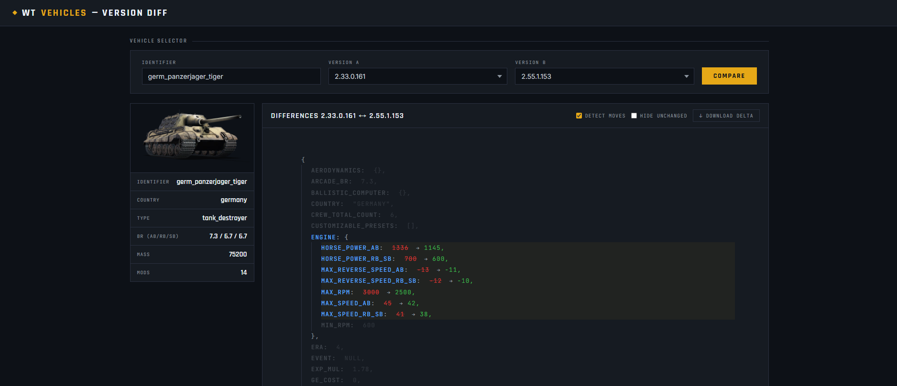
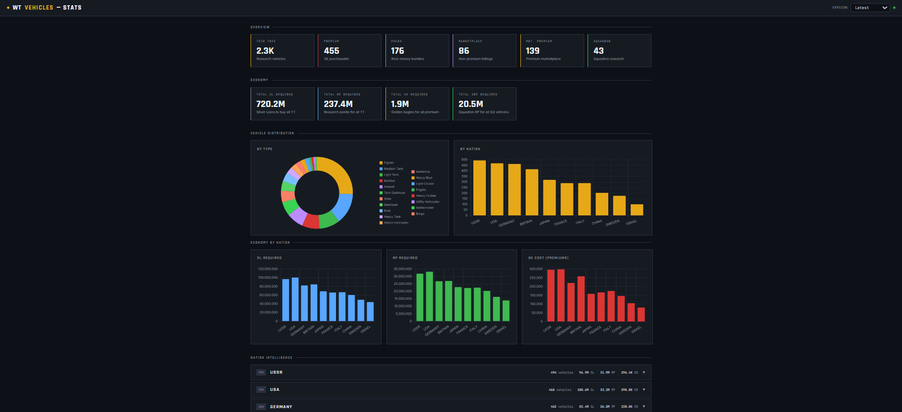

# War Thunder Vehicles API

>ℹ️ Due to issues with last hosting provider, the API has been moved to a new address: `https://wtvehiclesapi.duckdns.org/`

>⚠️ Due to user abuse I added rate limiting: 10K requests (separate for assets and JSON data) are allowed in a 72H window from the same domain/IP. Any attempt to bypass this limit (using VPN or domain/IP spoofing) will result in IP ban.  Users are **strongly** encouraged to implement some kind of caching, especially for assets. For larger traffic I suggest hosting the API yourself.

The War Thunder Vehicles API provides comprehensive data retrieval for all in-game vehicles, including hidden and event-specific vehicles. Access detailed information on vehicle performance, economic costs, armaments, and weapon presets. As the API is under active development, please note that some data may be subject to updates and corrections.

Explore the full documentation [here](https://wtvehiclesapi.duckdns.org/docs).

### Additional Tools
Additional webpages with small tools can be found at the following links:

- Vehicle version comparison: [here](https://wtvehiclesapi.duckdns.org/differences.html). It allows to compare different versions of the same vehicle. Useful to see the history of buffs and nerfs of a vehicle.

- Statistics viewer: [here](https://wtvehiclesapi.duckdns.org/dashboard.html). Allows to browse some statistics regarding the game economy and vehicle distribution.
  

## Features
- Localization for:
  - Weapons
  - Vehicles
  - Ammos
  - Ammo types
  - Explosives
- All BR ranges
- Hidden, premiums, packs and marketplace vehicles
- Extended economy data
- Engine parameters
- Thermal and night vision data
- Vehicles versions across multiple updates
- Modifications
- Tech tree prerequisites
- Custom weapon presets
- Techtree and statcard images

## Data Sources
All data comes from public datamines of the game files. Automated data extraction is being used to extrapolate only the important parameters. If you wish to host your own API to avoid rate limiting or stop relying on this one, you can do it by running the same [tool](https://github.com/Sgambe33/WT-Vehicle-Data-Extract) I do.

## Disclaimer
This API is an independent project and is not affiliated with Gaijin Entertainment in any capacity.
